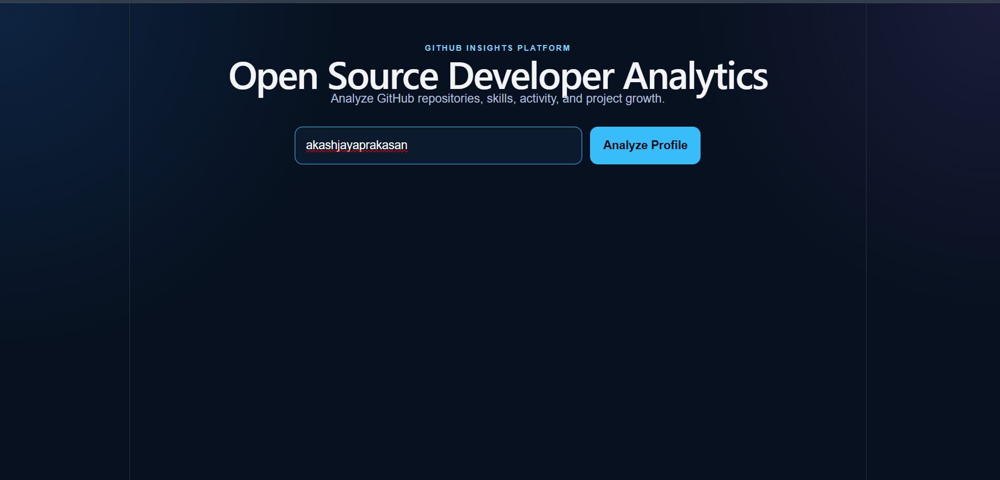
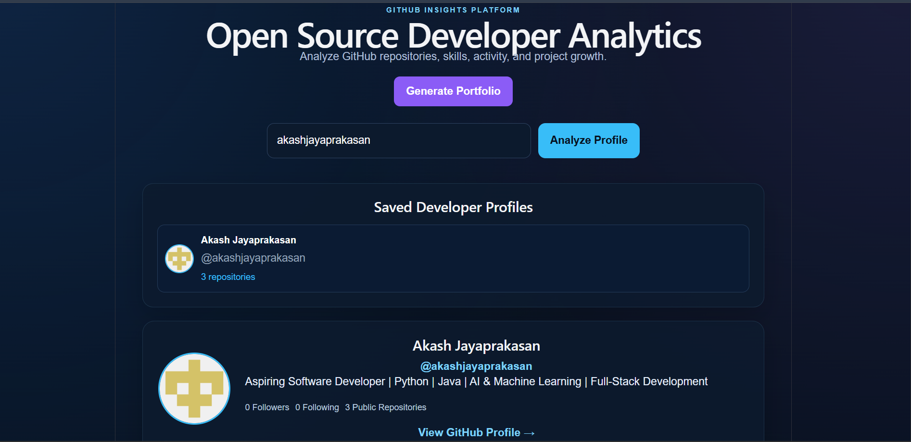
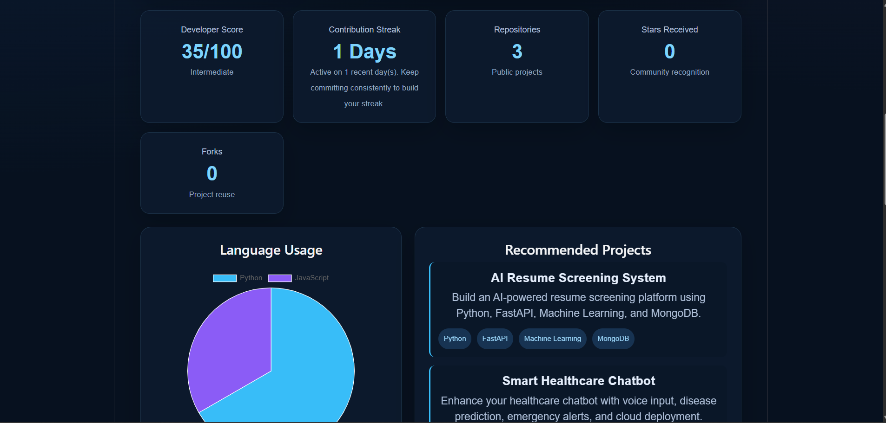
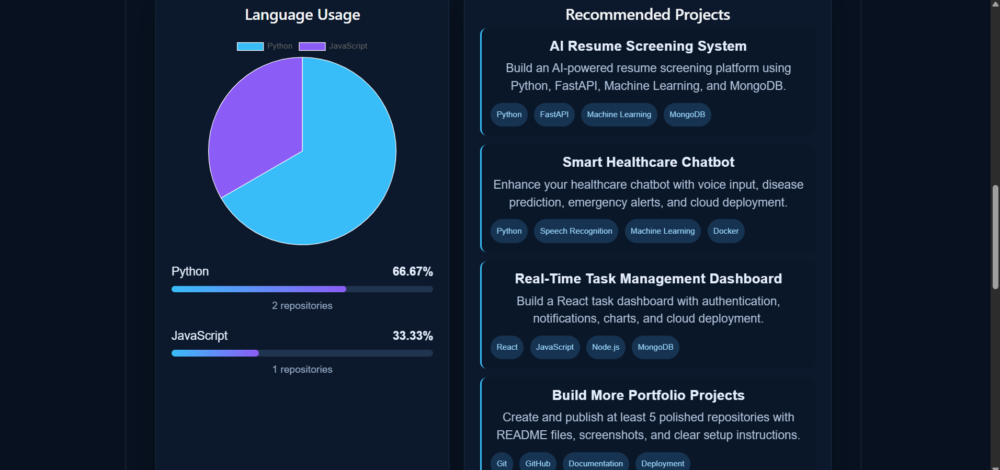
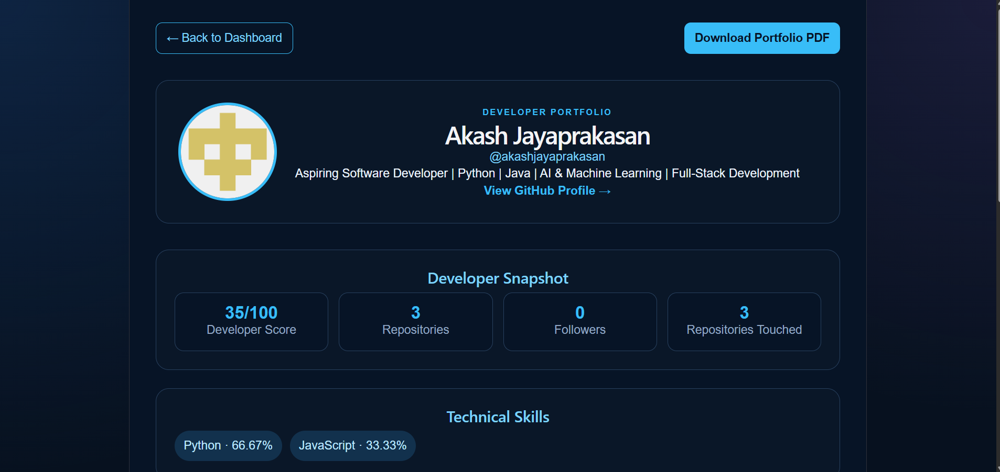

# Open Source Developer Analytics Platform

A full-stack web application that analyzes public GitHub developer profiles, repositories, programming languages, activity, and developer growth.

## Features

- GitHub profile analysis
- Repository statistics
- Programming language insights
- Developer score calculation
- Contribution activity and streak tracking
- Project recommendations based on skills
- Saved developer profiles using MongoDB Atlas
- Portfolio generation
- PDF portfolio export
- Responsive React dashboard

## Tech Stack

### Frontend

- React
- Vite
- Axios
- Chart.js
- jsPDF

### Backend

- FastAPI
- Python
- PyMongo
- GitHub REST API
- MongoDB Atlas

## Project Structure

```text
open-source-developer-analytics/
│
├── backend/
│   ├── app/
│   │   ├── main.py
│   │   ├── analytics.py
│   │   ├── database.py
│   │   ├── github_service.py
│   │   └── models.py
│   ├── requirements.txt
│   └── .env
│
├── frontend/
│   ├── src/
│   │   ├── App.jsx
│   │   ├── App.css
│   │   ├── Portfolio.jsx
│   │   └── Portfolio.css
│   ├── package.json
│   └── vite.config.js
│
└── docker-compose.yml
```

## Setup Instructions

### 1. Clone the repository

```bash
git clone https://github.com/akashjayaprakasan/open-source-developer-analytics.git
cd open-source-developer-analytics
```

### 2. Backend setup

```bash
cd backend
python -m venv venv
```

Activate the virtual environment:

**Windows PowerShell**

```powershell
.\venv\Scripts\Activate.ps1
```

Install dependencies:

```bash
pip install -r requirements.txt
```

Create a `.env` file inside the `backend` folder:

```env
MONGODB_URL=your_mongodb_atlas_connection_string
GITHUB_TOKEN=your_github_personal_access_token
```

Run backend:

```bash
python -m uvicorn app.main:app --host 127.0.0.1 --port 8000 --reload
```

### 3. Frontend setup

Open a new terminal:

```bash
cd frontend
npm install
npm run dev
```

Open:

```text
http://localhost:5173
```

## API Endpoints

| Method | Endpoint                          | Description                  |
| ------ | --------------------------------- | ---------------------------- |
| GET    | `/api/profile/{username}`         | Fetch GitHub profile details |
| GET    | `/api/repositories/{username}`    | Analyze repositories         |
| GET    | `/api/languages/{username}`       | Get language statistics      |
| GET    | `/api/score/{username}`           | Calculate developer score    |
| GET    | `/api/recommendations/{username}` | Get project recommendations  |
| GET    | `/api/activity/{username}`        | Get public GitHub activity   |
| GET    | `/api/streak/{username}`          | Get contribution streak      |
| GET    | `/api/saved-profiles`             | Get saved developer profiles |

## Environment Variables

Never upload your `.env` file.

```env
MONGODB_URL=your_mongodb_connection_string
GITHUB_TOKEN=your_github_token
```

## Author

**Akash Jayaprakasan**

GitHub: https://github.com/akashjayaprakasan

## Screenshots

### Home Page



### Developer Dashboard



### Analytics and Skills



### Recommendations and Activity



### Generated Portfolio


